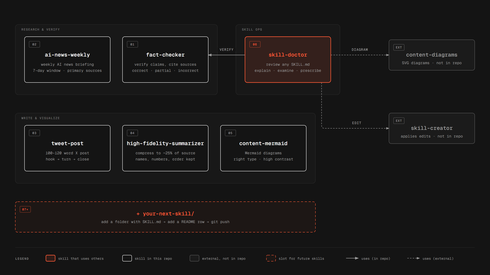

# AISkills

A collection of useful AI skills. Each skill lives in its own folder with a `SKILL.md` file that tells an AI agent (such as Claude) when to use the skill and how to carry it out.



## Skills

| # | Skill | Description |
|---|---|---|
| 1 | [fact-checker](fact-checker/SKILL.md) | Checks the factual claims in a piece of text against reputable sources. Returns a Markdown table rating each claim ✅ Correct, 🟡 Partially Correct, or ❌ Incorrect, with cited references, and offers a corrected version of the text. Answers in the same language as the claims. |
| 2 | [ai-news-weekly](ai-news-weekly/SKILL.md) | Produces a fact-only briefing of the most significant AI news from the last 7 days (models, research, open source, tools, infrastructure, funding, safety and regulation). Every item is checked live against official primary sources and dated inside the window. The briefing ends with summary counts, the sources checked, any blind spots, and the candidates that were dropped. |
| 3 | [tweet-post](tweet-post/SKILL.md) | Writes a 100–120 word X/Twitter post about technical work (your own project or someone else's paper or finding). Every post follows a hook → turn → substance → reasoning → close structure in plain A2–B1 English, keeps numbers exact, and ends with 2–3 specific hashtags. Supports English and Arabic (fusha). |
| 4 | [high-fidelity-summarizer](high-fidelity-summarizer/SKILL.md) | Compresses technical, legal, or financial text to about 25% of its length. It keeps every name, number, and term of art, follows the source's order and formatting, rewrites the prose in new words, and adds no outside information. Includes a `check_summary.py` script that checks the length band and flags terms that went missing. |
| 5 | [content-mermaid](content-mermaid/SKILL.md) | Creates Mermaid diagrams (flowcharts, sequence, state, ER, class, Gantt, mindmap, timeline) for technical processes and architectures. It picks the diagram type that fits the content and uses a consistent, high-contrast color system that looks the same in light and dark themes. |
| 6 | [skill-doctor](skill-doctor/SKILL.md) | Reviews an existing AI skill. It explains what the skill does, why, how and when it triggers, and can draw an optional workflow diagram. It then checks the skill's design quality and the technical accuracy of its content, and ends with a ranked list of fixes and an overall health rating. Edits are handed off to `skill-creator`. It works with [fact-checker](fact-checker/SKILL.md) (accuracy checks) and `content-diagrams` (diagrams) when those skills are available. |

## Usage

To use a skill with Claude Code, copy its folder into your skills directory:

```bash
cp -r fact-checker ~/.claude/skills/
```

Then ask Claude to "fact-check" some text, or invoke a skill directly by its name, for example `/fact-checker` or `/tweet-post`.
